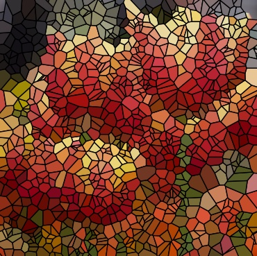
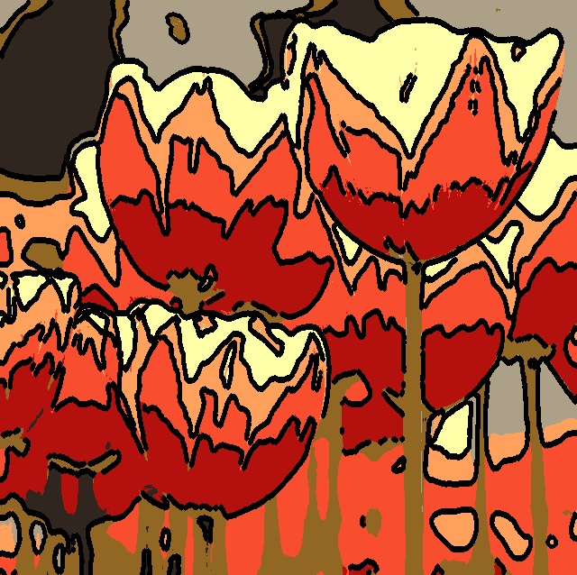
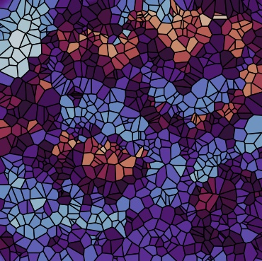
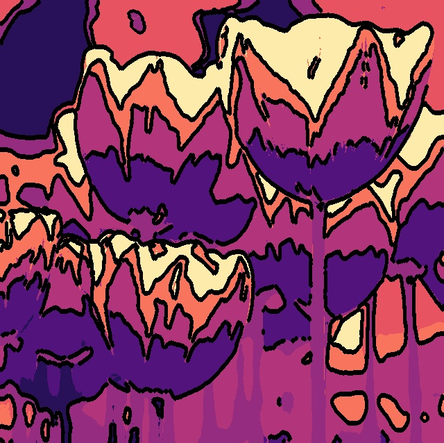
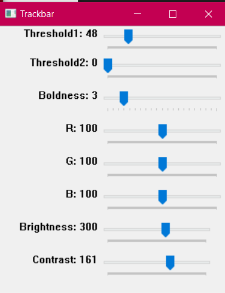

# Stainomic (Stained Glass Filter Application)

## CPE 101 Engineering Exploration - Python-based Final Project

Stainomic is a Python-based application that applies stained glass effects to images. This project was developed as part of the CPE 101 Engineering Exploration course.

---

## Installation Guide

### Prerequisites
Before running the program, ensure you have the following installed:
- Python 3 (Download from [python.org](https://www.python.org/downloads/))
- Required Python libraries listed in `requirements.txt`

### Steps to Install
1. **Install Python 3** if you haven't already.
2. **Install dependencies**:
   - Open a command prompt (CMD) or terminal.
   - Navigate to the project directory using:
     ```sh
     cd path/to/Stainomic
     ```
   - Install required libraries:
     ```sh
     pip install -r requirements.txt
     ```

---

## Running the Application
### Option 1: Using GUI
- Double-click on `gui-rework.py` to launch the graphical interface.
- Alternatively, right-click the file and select **Open with Python**.

### Option 2: Running from Terminal
- Open a command prompt or terminal.
- Navigate to the project folder:
  ```sh
  cd path/to/Stainomic
  ```
- Run the application with:
  ```sh
  python gui-rework.py
  ```

---

## Features
- Apply stained glass effects to images. (using Voronoi Plot)

  **Example:**
<div style="display: flex; gap: 10px;">
  
  
</div>

- Apply comic-like effects to images. (using Image Segmentation)

  **Example:**
<div style="display: flex; gap: 10px;">
  
  
</div>

- Color Filter Preset for image (using cv2 built-in Gradient)
  **Example:**  
<div style="display: flex; gap: 10px;">
  
  
</div>


- Trackbar For Adjusting Color, Brightness, Line Threshold (for Comic Filter)
  
  

---

## License
This project is for educational purposes only.

